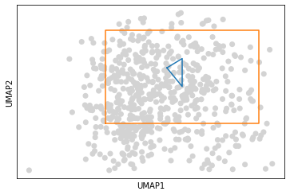
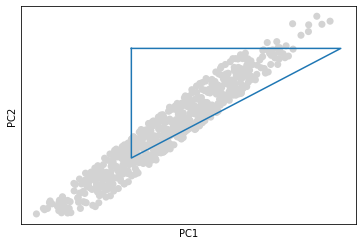
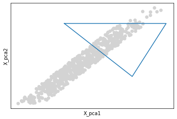
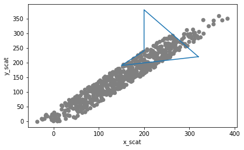

# Mock
```{eval-rst}
.. role:: small
```

```{eval-rst}
.. role:: smaller
```
## Using the mock parameter in scSELpy.

In order to have scSELpy automatically draw polygons, we have to pass the coordinates of these polygons to scSELpy by using the mock parameter.

The input of the mock parameter is always structed the same. A dict, where the entries are 'umap', 'pca', 'tsne' and 'scat'. For each entry, you ahve a list within a list, the inner list provides the coordinates for the polygons.

Lets take a look.


```python
 
#If plots are not being shown on Jupyter Notebook, try using:
#%matplotlib inline

import scanpy as sc 
import scselpy as scS 
adata = scS.generate.adata()
scS.settings.verbosity=1
```


Lets create a dict.


```python
Mock_dict = {
    'umap':[
        [(180,220),(200,240),(200,180)],#polygon 1 cords
        [(100,100),(100,300),(300,300),(300,100)] # 2
    ]

    
    
}
```


```python
sc.pl.umap(adata,show=False)
```


    <Axes: xlabel='UMAP1', ylabel='UMAP2'>


    

    


```python
scS.pl.umap(adata,mock=Mock_dict)
```


    

    


Now to run the same for e.g. PCA, we would need to make an entry for PCA.
We can also run PCA using the embedding parameter, so lets also make one for embedding.


```python
Mock_dict = {
    'umap':[
        [(180,220),(200,240),(200,180)],#polygon 1 cords
        [(100,100),(100,300),(300,300),(300,100)] # 2
    ]
        
    

        ,
    'pca':[[(100,300),(400,300),(100,100)]]
            ,

    'embedding':[[(100,300),(400,300),(300,100)]]

    
    
    
    
}
```


```python
scS.pl.pca(adata,mock=Mock_dict)
```


    

    


```python
scS.pl.embedding(adata,basis="X_pca",mock=Mock_dict)
```


    

    


Now we want to run another PCA, but different coordinates. We also want to run TSNE and scatter plots.


```python
Other_dict = {

        
    'pca':[[(20,60),(40,70),(120,100),(80,30),(30,10)]]
            ,
    
    'tsne':[[(180,220),(200,240),(260,260),(200,180)],#1
        [(70,70),(70,350),(350,350),(350,70)],#2
           [(200,200),(50,200),(50,50),(200,50)]] #3 
    ,
    'scatter':[[(320,220),(150,190),(200,240),(200,380)]] 
        
    
    
    
}
```


```python
scS.pl.pca(adata,mock=Other_dict)
```


    

    


```python
scS.pl.tsne(adata,mock=Other_dict,line_labels=["1","2","3"])
```


    

    


If you first want to select cells by drawing polygons and save these coordinates in mock dicts, there are two ways to obtain them. 1) Use scSELpy.pl.embedding(adata,printcords=True) 2) get them from adata.uns['REMAP_1'].


```python
scS.pl.scatter(adata,"x_scat","y_scat",mock=Other_dict)
```


    

    


```python

```
